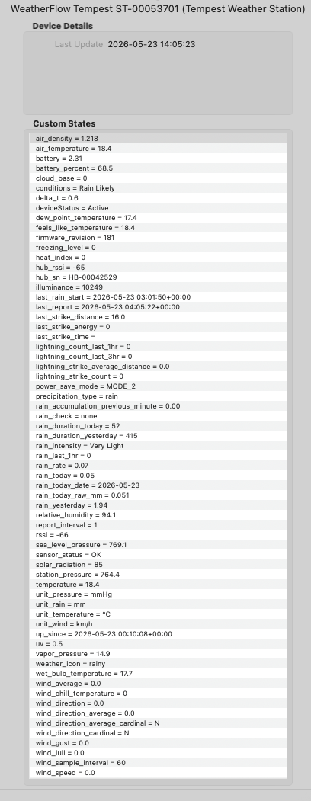

# WeatherFlow Tempest Weather Station — Indigo Plugin

Receives live weather data from [WeatherFlow Tempest](https://weatherflow.com/tempest-weather-system/) stations via **local UDP broadcast** and maps all sensor observations to Indigo device states. No cloud account or API key is required. Everything runs on your local network.

## Screenshot

*Indigo device states for a Tempest Weather Station showing live sensor readings and unit labels.*

## Features

| Category | What you get |
|---|---|
| **Temperature** | Ambient, feels-like, dew point, wet bulb, wind chill, heat index, delta-T |
| **Atmospheric** | Station pressure, sea-level pressure, relative humidity, vapour pressure, air density |
| **Wind** | Instantaneous speed/direction (rapid-wind, ~3 s), 1-minute average, gust, lull, cardinal, sample interval |
| **Rain** | Per-minute accumulation, rain rate, intensity label, daily total, yesterday's total, Rain Check status |
| **Lightning** | Strike count, average distance, last-strike distance, energy and timestamp |
| **Light** | Illuminance (lux), solar radiation (W/m²), UV index |
| **Battery** | Voltage and percentage; power-save mode label; report interval |
| **Derived** | Cloud base, freezing level (both require altitude to be set) |
| **Diagnostics** | RSSI, firmware version, sensor fault flags, silence detection |
| **Hub** | Firmware, Wi-Fi RSSI, uptime, reset reasons |

## Navigation

| Page | Contents |
|---|---|
| [[Installation]] | Requirements and install steps |
| [[Plugin-Configuration]] | UDP port, log levels, device auto-generation |
| [[Tempest-Device-Configuration]] | Unit selection, altitude, device picker |
| [[Device-States]] | Every state — what it means, units, notes |
| [[Triggers]] | Lightning, rain-start, and rapid-wind triggers |
| [[Rain-Data]] | How daily rain is sourced and why power-save mode matters |
| [[Troubleshooting]] | Common problems and fixes |
| [[Architecture]] | Internal design: UDP → asyncio → Indigo |

## Requirements

| Requirement | Version |
|---|---|
| Indigo | 2025.2 or later (ServerApiVersion 3.4) |
| WeatherFlow hub | Any — must be on the same subnet as the Indigo Mac |

## Quick Start

1. Install the plugin (double-click `WeatherFlowTempest.indigoPlugin`).
2. Go to **Plugins → WeatherFlow Tempest → Configure → Generate Devices**.
3. Done — states populate within 60 seconds of the first UDP broadcast.

See [[Installation]] for full details.

## Screenshot

*Indigo device states for a Tempest Weather Station, showing live sensor readings and unit labels.*

---

## Requirements

| Requirement | Version |
|---|---|
| Indigo | 2025.2 or later (ServerApiVersion 3.4) |
| WeatherFlow hub | Any — must be on the same subnet as the Indigo Mac |

---

## Installation

1. Download `WeatherFlowTempest.indigoPlugin` and double-click it to install.
2. Indigo will prompt to enable the plugin — click **Enable**.
3. The plugin begins listening on UDP port **50222** immediately. No further configuration is required to start receiving data.

---

## Device Setup

### Auto-create all devices at once (recommended)

1. Open **Plugins → WeatherFlow Tempest Weather Station → Configure**.
2. Click **Generate Devices**.
3. The plugin creates one Indigo device for every Tempest and Hub currently broadcasting on the network. Devices are placed in the main Indigo device folder and can be moved afterward.
4. Re-click the button whenever new hardware is added.

### Manual device creation

1. Go to **Devices → New Device → Type: WeatherFlow Tempest Weather Station**.
2. Choose **Tempest Weather Station** or **WeatherFlow Hub**.
3. Select your unit from the dropdown — devices are listed as soon as the hub broadcasts.
4. Click **Save**.

> **Tip:** If the device dropdown is empty, the hub has not yet sent a broadcast. Wait 30–60 seconds and use the **Reload** button in the dialog to refresh the list.

---

## Tempest Device Configuration

| Field | Description |
|---|---|
| **Tempest Device** | Serial number of the Tempest (ST-xxxxxxxx), discovered automatically |
| **Altitude (m)** | Station elevation in metres above sea level. Used to calculate sea-level pressure, cloud base, and freezing level. Set to `0` to omit those derived states. |
| **Units — Temperature** | °C or °F |
| **Units — Pressure** | hPa (mbar), mmHg, or inHg |
| **Units — Wind Speed** | m/s, km/h, mph, or knots |
| **Units — Rain** | mm or inches |

Unit selections are independent — mix and match as needed. Changes take effect on the next sensor observation (within ~1 minute). Active unit labels are reflected in the `unit_temperature`, `unit_pressure`, `unit_wind`, and `unit_rain` device states.

---

## Device States

### Tempest Weather Station

#### Temperature
| State | Description |
|---|---|
| `air_temperature` | Ambient temperature |
| `feels_like_temperature` | Apparent / feels-like temperature |
| `dew_point_temperature` | Dew point |
| `wet_bulb_temperature` | Wet bulb temperature |
| `wind_chill_temperature` | Wind chill |
| `heat_index` | Heat index |
| `delta_t` | Delta-T (dry bulb minus wet bulb) |

#### Atmospheric
| State | Description |
|---|---|
| `relative_humidity` | Relative humidity (%) |
| `station_pressure` | Raw station pressure |
| `sea_level_pressure` | Sea-level corrected pressure (requires altitude > 0) |
| `vapor_pressure` | Vapour pressure |
| `air_density` | Air density (kg/m³, always metric) |

#### Derived (require altitude > 0)
| State | Description |
|---|---|
| `cloud_base` | Estimated cloud base height above station |
| `freezing_level` | Estimated freezing level height above station |

#### Light & UV
| State | Description |
|---|---|
| `illuminance` | Illuminance (lux) |
| `solar_radiation` | Solar irradiance (W/m²) |
| `uv` | UV index |

#### Rain
| State | Description |
|---|---|
| `rain_accumulation_previous_minute` | Rain accumulated in the previous minute |
| `rain_rate` | Current rain rate (mm/h or in/h) |
| `precipitation_type` | `none`, `rain`, `hail`, or `rain_hail` |
| `last_rain_start` | Timestamp of the most recent rain-start event (UTC) |

#### Lightning
| State | Description |
|---|---|
| `lightning_strike_count` | Strikes detected in the last 3 minutes |
| `lightning_strike_average_distance` | Average distance of recent strikes |
| `last_strike_distance` | Distance of the most recent strike |
| `last_strike_energy` | Energy of the most recent strike |

#### Wind
| State | Description |
|---|---|
| `wind_speed` | Instantaneous wind speed (rapid-wind, ~3 s interval) |
| `wind_average` | 1-minute average wind speed |
| `wind_gust` | 1-minute wind gust |
| `wind_lull` | 1-minute wind lull |
| `wind_direction` | Instantaneous wind direction (°) |
| `wind_direction_average` | 1-minute average wind direction (°) |
| `wind_direction_cardinal` | Instantaneous cardinal direction (N, NE, …) |
| `wind_direction_average_cardinal` | Average cardinal direction |

#### Unit labels
| State | Description |
|---|---|
| `unit_temperature` | Active temperature unit label (e.g. `°C`) |
| `unit_pressure` | Active pressure unit label (e.g. `hPa`) |
| `unit_wind` | Active wind speed unit label (e.g. `km/h`) |
| `unit_rain` | Active rain unit label (e.g. `mm`) |

#### Battery & power
| State | Description |
|---|---|
| `battery` | Battery voltage (V) |
| `battery_percent` | Battery level (%) |
| `power_save_mode` | Active power-save mode name |

#### Diagnostics
| State | Description |
|---|---|
| `rssi` | Tempest RF signal strength (dBm) |
| `hub_rssi` | Hub RF signal strength (dBm) |
| `firmware_revision` | Tempest firmware version |
| `hub_sn` | Hub serial number |
| `up_since` | Device power-on timestamp (UTC) |
| `last_report` | Timestamp of the most recent observation (UTC) |
| `sensor_status` | Sensor fault flags, or `OK` |
| `deviceStatus` | `Active` when data is flowing; `Waiting for data` on startup; `No data — last seen N min ago` if the station goes silent |

---

### WeatherFlow Hub

| State | Description |
|---|---|
| `firmware_revision` | Hub firmware version |
| `rssi` | Hub Wi-Fi signal strength (dBm) |
| `up_since` | Hub power-on timestamp (UTC) |
| `uptime` | Seconds since last boot |
| `reset_flags` | Reason(s) for the last reset (comma-separated) |
| `deviceStatus` | Connection status |

---

# Triggers

Three custom trigger types are available under **Triggers → New Trigger → WeatherFlow Tempest Weather Station**.

Each trigger includes a **Tempest Device** picker so it can be scoped to a specific station when you have more than one.

## Lightning Strike Detected

Fires whenever the selected Tempest detects a lightning strike.

**Configuration:**

| Field | Description |
|---|---|
| **Tempest Device** | The Tempest station to watch. Leave blank to fire for any station. |

**Use cases:**
- Send a push notification with distance and energy.
- Flash a light or sound an alert.
- Log strikes to a variable for counting.

**Available at trigger time:** The `last_strike_distance`, `last_strike_energy`, and `last_strike_time` device states are updated before the trigger fires, so you can read them in trigger actions.

## Rain Started

Fires when the Tempest detects the onset of precipitation (the first rain-start event after a dry period).

**Configuration:**

| Field | Description |
|---|---|
| **Tempest Device** | The Tempest station to watch. |

**Use cases:**
- Close roof vents or skylights.
- Retract a pergola awning.
- Send a "rain started" notification.

> **Note:** This trigger fires from the Tempest's dedicated rain-start event, which is sent immediately when the sensor detects rain — independent of the 1-minute observation cycle. It fires once per rain onset, not repeatedly while rain continues.

The `last_rain_start` device state is updated when this trigger fires.

## Rapid Wind Exceeds Threshold

Fires when an instantaneous wind reading meets or exceeds a configurable speed.

Rapid-wind readings arrive approximately **every 3 seconds**, giving near-real-time wind monitoring.

**Configuration:**

| Field | Description |
|---|---|
| **Tempest Device** | The Tempest station to watch. |
| **Threshold (m/s)** | Minimum wind speed (in m/s) required to fire the trigger. |

**Use cases:**
- Close greenhouse vents above 10 m/s.
- Retract a sail shade above 15 m/s.
- Log wind gusts to a time-stamped variable.

> The threshold is always compared against the **raw m/s magnitude** regardless of the display unit set in the device configuration. Convert your target speed if needed: 1 m/s = 3.6 km/h = 2.237 mph = 1.944 kn.

## Trigger Limitations

- In power-save **MODE_2** and above, rapid-wind events are not sent by the Tempest. The *Rapid Wind Exceeds Threshold* trigger will not fire in those modes. The `wind_speed` state still updates from the 1-minute observation, but at a lower frequency.
- Lightning and rain-start triggers fire from discrete UDP events and are not affected by power-save mode.
---

## Station Silence Detection

The plugin monitors each Tempest station for data dropouts. If no observation is received for more than **5 minutes**:

- The `deviceStatus` state is updated to `"No data — last seen N min ago"`, making the outage visible in the Indigo device list without checking logs.
- A warning is written to the Indigo Event Log.
- The warning repeats every **30 minutes** for as long as the silence continues, with an updated elapsed time.

When data resumes, `deviceStatus` returns to `"Active"` automatically on the next observation, and a recovery notice is logged.

The plugin also monitors the UDP listener itself. If the background socket task crashes for any reason, the listener is restarted automatically within 60 seconds.

---

## Plugin Preferences

Open **Plugins → WeatherFlow Tempest Weather Station → Configure**.

| Setting | Description |
|---|---|
| **Generate Devices** | Auto-create Indigo devices for all discovered WeatherFlow hardware |
| **UDP Port** | Port the hub broadcasts on (default: `50222`) |
| **Listen Address** | Network interface to listen on (default: `0.0.0.0` = all interfaces) |
| **Indigo Log Level** | Verbosity of messages in the Indigo Event Log |
| **File Log Level** | Verbosity of messages written to the plugin log file |

Saving the preferences automatically restarts the UDP listener.

---

## Plugin Menu

**Plugins → WeatherFlow Tempest Weather Station** exposes two menu commands:

- **List Discovered WeatherFlow Devices** — logs all currently-discovered serial numbers, models, and firmware versions to the Event Log.
- **Restart UDP Listener** — stops and restarts the listener without reloading the plugin (useful after network changes).

---

## Troubleshooting

**Device dropdown is empty / "No devices discovered yet"**
- Confirm the WeatherFlow hub is on the same subnet as the Indigo Mac. UDP broadcast does not cross router boundaries.
- Check that nothing is blocking UDP port 50222 (macOS firewall, managed switch, VLAN separation).
- Wait 60 seconds — hubs broadcast a status packet roughly once per minute — then use the **Reload** button in the device dialog.

**`deviceStatus` shows "No data — last seen N min ago"**
- The station has not sent an observation in over 5 minutes. Check the hub's power and Wi-Fi connection, and confirm the Tempest is within RF range.
- Check the Indigo Event Log for listener errors. Use **Plugins → WeatherFlow → Restart UDP Listener** to retry without reloading the plugin.

**`sea_level_pressure`, `cloud_base`, `freezing_level` are missing**
- Set **Altitude (m)** to a non-zero value in the Tempest device configuration.

**`sensor_status` shows all sensors failed**
- This is a known reporting quirk in some Tempest firmware versions where the raw hardware register value is broadcast before the sensor self-test completes. The plugin detects this pattern and displays `OK` instead. If only a subset of sensors are listed as failed, that is a genuine fault.

**Debug logging**
- Set **Indigo Log Level** to *Debugging Messages* in Plugin Preferences for verbose output in the Event Log.
- The plugin log file is written independently to `~/Library/Application Support/Perceptive Automation/Indigo 2025.x/Logs/`. Set **File Log Level** to *Detailed Debugging Messages* for maximum detail.

---

## Libraries & Acknowledgements

This plugin is built on several excellent open-source libraries bundled within the plugin package:

### [pyweatherflowudp](https://github.com/natekspencer/pyweatherflowudp) — v1.5.2
*by Nathan Spencer ([@natekspencer](https://github.com/natekspencer))*

The core UDP library that handles all communication with the WeatherFlow hub. It provides an event-based asynchronous interface, parses every WeatherFlow message type (observations, rapid wind, lightning strikes, rain events, device status), and exposes sensor values as typed properties with full unit support.

All derived meteorological calculations in the plugin — dew point, wet bulb temperature, heat index, feels-like temperature, vapour pressure, air density, sea-level pressure, cloud base, and freezing level — are provided by this library.

Licensed under MIT. If you find it useful, consider [supporting Nathan on Ko-fi](https://ko-fi.com/natekspencer).

### [Pint](https://pint.readthedocs.io/) — v0.25.3
Physical quantity handling with units. All sensor values from pyweatherflowudp carry their native unit (e.g. metres per second, millibars) and are converted to the user's chosen display unit using Pint's unit registry. This ensures unit conversions are numerically correct and the original precision is preserved.

### [PsychroLib](https://github.com/psychrometrics/psychrolib) — v2.5.0
Psychrometric calculations used by pyweatherflowudp to derive wet bulb temperature and related humidity metrics from the raw sensor readings.

---

## License

MIT — see [LICENSE](LICENSE) for details.

Developed by GlennNZ.
